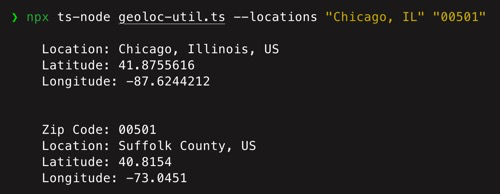
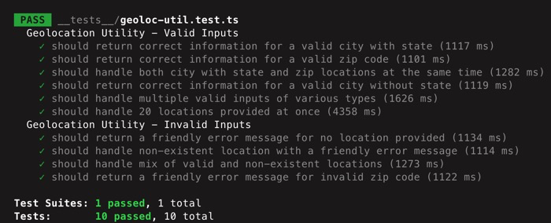

# Geolocation Utility Setup and Run Instructions

### Implementation notes

API key:  
- In this particular case the key is used directly in the code to get up and running quickly. Normally I would configure keys as environment variables.
  
  
Utility:  
- For commands that result in multiple locations, only the first location is returned. (Allowed in the requirements document)
- I also excluded 'local names' property from the output data to keep the output light and clean for this specific case. ('local names' property returns the city name in all the different languages)
- Additional error handling for things like rate limits would usually be introduced as well


Testing:  
- The utility outputs are processed into a user-friendly format instead of plain json. That means the tests are asserting against plain text as opposed to json since I went in favor of the utility being more user-friendly. Another strategy would be to introduce --json flag that would return json, if we want to test against that and use dedicated assertions for json structure etc.
- Ideally I would extend the test coverage but these are some valid and invalid test examples.


## Prerequisites
- Node.js (preferably the latest LTS version)

## Setup Steps

1. Clone and cd into the repository in your shell
2. Install dependencies:
   ```
   npm install
   ```

## Running the Utility

Note on ts-node:  
This project uses ts-node as a dev dependency. The npx command ensures that the project's local version of ts-node is used, avoiding the need for global installation.

To run the utility, use the following command (works on all operating systems):

```
npx ts-node geoloc-util.ts --locations "Houston, TX" "60611"
```

You can replace the locations with any cities, states, or zip codes you want to look up.  



## Running the Tests

   ```
   npm test
   ```
